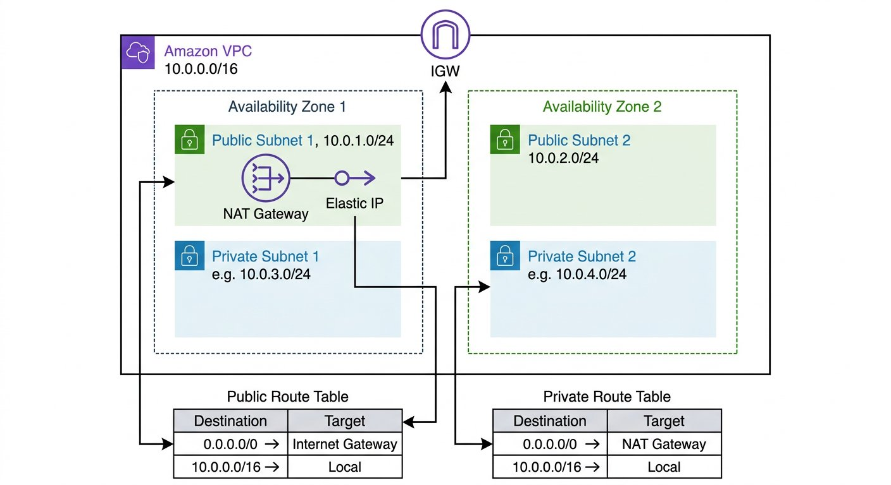

# Déploiement AWS VPC automatisé avec Terraform (Lab-VPC1)

[English description below]

Ce projet présente le déploiement de bout en bout d'une infrastructure réseau hautement disponible et sécurisée sur Amazon Web Services (AWS) dans la région `eu-west-1` (Europe - Irlande). L'intégralité de la configuration est automatisée à l'aide de Terraform (Infrastructure as Code).

## 📊 Architecture Réseau

L'architecture s'appuie sur un plan d'adressage IP robuste et segmenté pour isoler les ressources de manière optimale.



- **VPC** : `Lab-vpc1` (CIDR : `10.2.0.0/16`)
- **Zones de disponibilité (AZ)** : `eu-west-1a` et `eu-west-1b`
- **Sous-réseaux publics** :
  - `Lab-vpc1-public-subnet-1` (`10.2.1.0/24`) — zone `eu-west-1a` (héberge la NAT Gateway)
  - `Lab-vpc1-public-subnet-2` (`10.2.2.0/24`) — zone `eu-west-1b`
- **Sous-réseaux privés** :
  - `Lab-vpc1-private-subnet-1` (`10.2.3.0/24`) — zone `eu-west-1a`
  - `Lab-vpc1-private-subnet-2` (`10.2.4.0/24`) — zone `eu-west-1b`
- **Passerelles** :
  - **Internet Gateway (IGW)** : Point d'entrée et de sortie Internet pour les sous-réseaux publics.
  - **NAT Gateway (avec Elastic IP)** : Permet aux serveurs privés d'accéder de manière sécurisée à Internet pour les mises à jour sans être accessibles depuis l'extérieur.

---

## 🧭 Démarche et Organisation Logique du Projet

La réalisation de ce projet s'est articulée autour de quatre piliers fondamentaux :

### 1. Contexte (Situation)
La nécessité de concevoir de zéro une fondation réseau AWS solide et sécurisée pour héberger des applications Web modernes. L'un des principaux défis consistait à isoler le trafic public (front-end) du trafic privé (back-end et bases de données), tout en assurant une haute disponibilité (multi-AZ) et en évitant les configurations manuelles instables dans la console AWS (bannissement du "ClickOps").

### 2. Objectifs (Tâche)
La planification, le dimensionnement des sous-réseaux et la modélisation complète de l'architecture. Le cahier des charges comprenait :
- La création du VPC racine avec résolution DNS.
- La division en 4 sous-réseaux (2 publics, 2 privés) sur deux AZ.
- L'attribution d'une IP fixe publique (Elastic IP) dédiée à une NAT Gateway.
- L'isolation stricte des routes réseau pour interdire tout accès entrant non sollicité vers les instances privées.

### 3. Actions Menées (Action)
Le développement et l'implémentation de la solution réseau via l'Infrastructure as Code (IaC) :
- Écriture de scripts Terraform déclaratifs (`main.tf`, `routes.tf`, `variables.tf`).
- Gestion fine des dépendances implicites (utilisation de `depends_on` pour garantir que la NAT Gateway ne soit provisionnée qu'après la mise à disposition de l'Internet Gateway).
- Création de tables de routage séparées pour le trafic public (vers l'IGW) et le trafic privé (vers la NAT Gateway).
- Validation rigoureuse par les commandes `terraform plan` et déploiement via `terraform apply`.

### 4. Résultats Obtenus (Résultat)
Une infrastructure réseau 100 % opérationnelle, documentée, auditable et reproductible en moins de 2 minutes :
- Déploiement sans erreur de 15 ressources cloud interconnectées sur AWS.
- Cartographie visuelle et validation fonctionnelle impeccables au sein de la console AWS.
- Les flux sortants fonctionnent parfaitement pour les composants privés, sans exposition à Internet.
- Possibilité de détruire (`terraform destroy`) ou de cloner l'environnement complet (Staging/Production) à l'infini en conservant une cohérence absolue.

---

## 🛠️ Utilisation de Terraform

### Prérequis
- [Terraform CLI](https://developer.hashicorp.com/terraform/downloads) installé localement.
- Un compte AWS avec des identifiants configurés dans vos variables d'environnement (`AWS_ACCESS_KEY_ID` et `AWS_SECRET_ACCESS_KEY`).

### Commandes d'exécution
1. **Initialiser le répertoire de travail** :
   ```bash
   terraform init
   ```
2. **Formater et valider la syntaxe des scripts** :
   ```bash
   terraform fmt && terraform validate
   ```
3. **Préparer et inspecter le plan d'exécution** :
   ```bash
   terraform plan -out=plan.out
   ```
4. **Appliquer et provisionner les ressources sur AWS** :
   ```bash
   terraform apply plan.out
   ```
5. **Détruire l'infrastructure réseau proprement** :
   ```bash
   terraform destroy
   ```

---

# 🇬🇧 Automated AWS VPC Deployment with Terraform (Lab-VPC1)

This project features the end-to-end deployment of a highly available and secure network infrastructure on Amazon Web Services (AWS) inside the `eu-west-1` (Europe - Ireland) region. The entire setup is automated via Terraform (Infrastructure as Code).

## 📊 Network Architecture

The architecture relies on a robust and segmented IP address space plan to isolate resources optimally.

- **VPC**: `Lab-vpc1` (CIDR: `10.2.0.0/16`)
- **Availability Zones (AZ)**: `eu-west-1a` and `eu-west-1b`
- **Public Subnets**:
  - `Lab-vpc1-public-subnet-1` (`10.2.1.0/24`) — zone `eu-west-1a` (hosts the NAT Gateway)
  - `Lab-vpc1-public-subnet-2` (`10.2.2.0/24`) — zone `eu-west-1b`
- **Private Subnets**:
  - `Lab-vpc1-private-subnet-1` (`10.2.3.0/24`) — zone `eu-west-1a`
  - `Lab-vpc1-private-subnet-2` (`10.2.4.0/24`) — zone `eu-west-1b`
- **Gateways**:
  - **Internet Gateway (IGW)**: Ingress/Egress internet point of contact for public subnets.
  - **NAT Gateway (with Elastic IP)**: Allows private servers to securely connect to the internet for system updates without being reachable from the outside.

---

## 🧭 Project Logic & Workflow

The engineering process of this deployment was designed around four logical pillars:

### 1. Context (Situation)
The crucial need to design a highly available, robust, and secure network foundation on AWS to host modern cloud workloads. The core challenge lay in separating public traffic (front-end) from private workloads (back-end and databases) while maintaining high availability (multi-AZ) and avoiding error-prone manual configurations on the AWS Console.

### 2. Objectives (Task)
Mapping, subnet sizing, and layout planning of the target architecture. Objectives included:
- Creating the root VPC with DNS support enabled.
- Dividing it into 4 subnets (2 public, 2 private) across two AZs.
- Allocating an Elastic IP (EIP) dedicated to a public NAT Gateway.
- Ensuring tight routing policies to block any unsolicited ingress to private servers.

### 3. Actions Taken (Action)
Developing and deploying the network architecture via Infrastructure as Code (IaC):
- Writing clean and modular Terraform configuration scripts (`main.tf`, `routes.tf`, `variables.tf`).
- Managing implicit resources dependencies (e.g. using `depends_on` to ensure the NAT Gateway is only provisioned after the IGW is active).
- Establishing explicit public (to IGW) and private (to NAT GW) route tables.
- Running syntax and safety checks (`terraform validate`, `terraform plan`, `terraform apply`).

### 4. Results Obtained (Result)
A 100% operational, fully automated, and reproducible network environment deployed in under 2 minutes:
- Flawless deployment of 15 interconnected cloud resources.
- Visual mapping validation and consistency confirmed within the AWS Console.
- Private resources are fully capable of downloading updates via the NAT GW while staying completely isolated.
- The environment can be easily torn down (`terraform destroy`) or duplicated to other AWS regions instantly.
